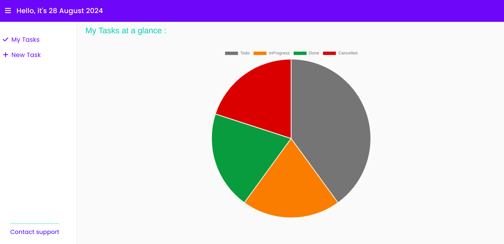
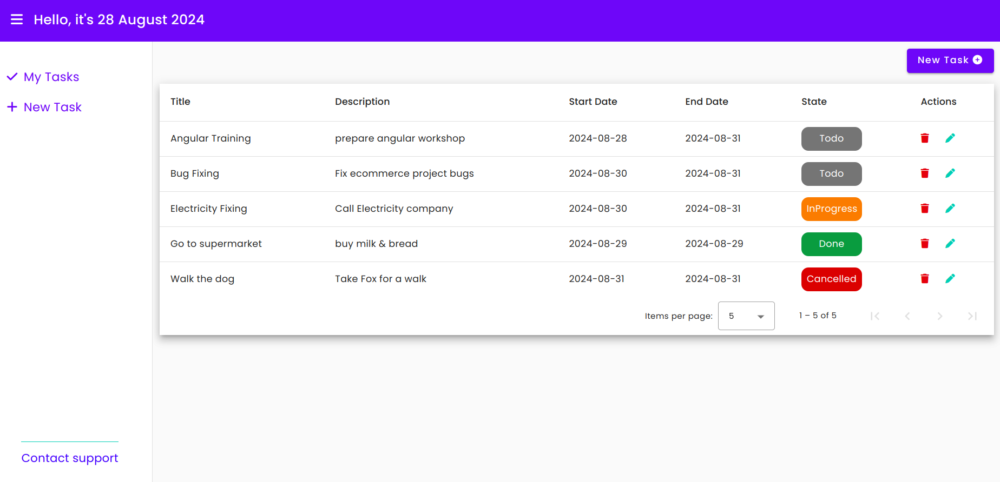
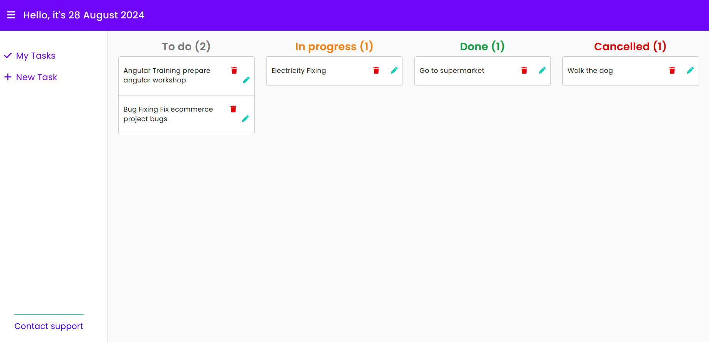
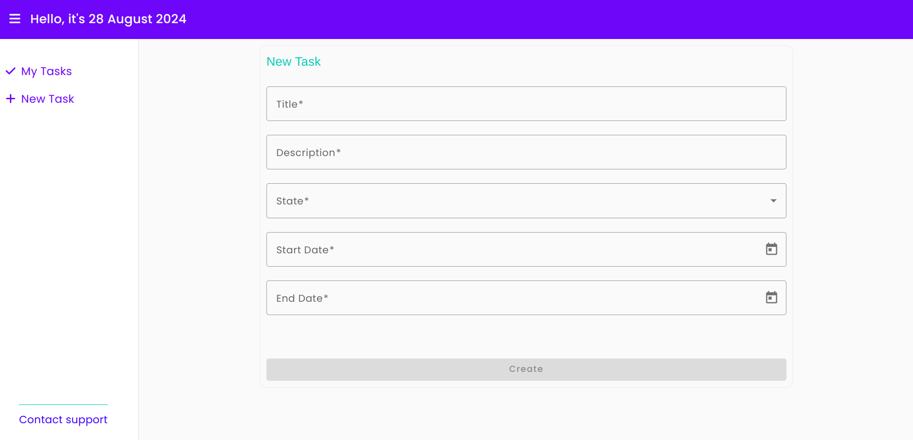
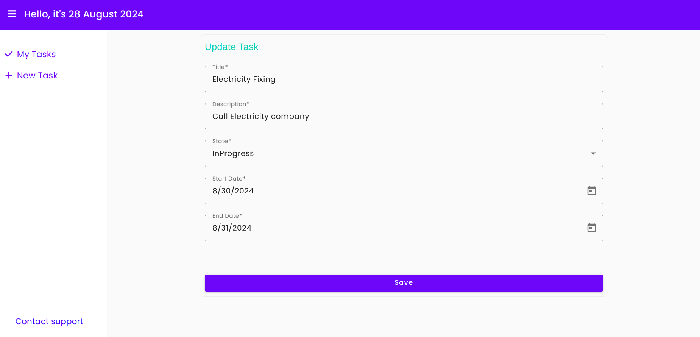
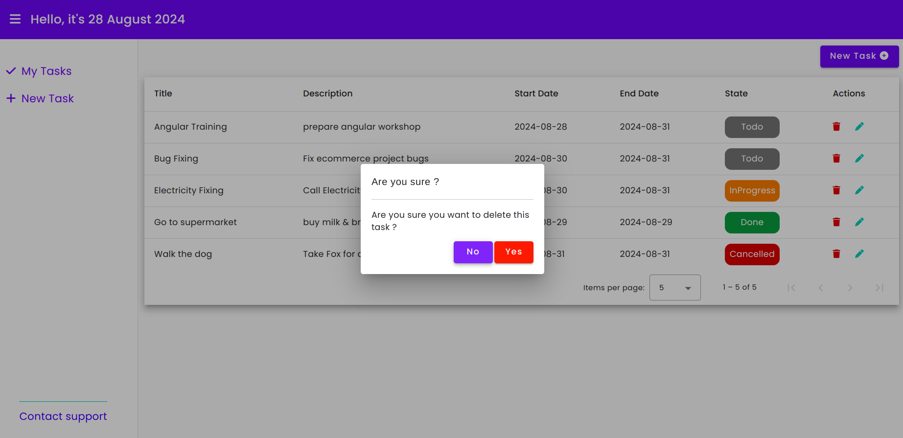

# TodoApp

This project was generated with [Angular CLI](https://github.com/angular/angular-cli) version 16.2.12.

## Install dependencies

Run `npm install` or `npm install --legacy-peer-deps` to install dependencies.  
    ----> in Addition to core dependencies, the application uses:  
              - NgRX  
              - Angular material  
              - Bootstrap  
              - fontawesome  
              - ng-chart  

## Development server

Run `ng serve` for a dev server. Navigate to `http://localhost:4200/`. The application will automatically reload if you
change any of the source files.

## Running unit tests

Run `ng test` to execute the unit tests via [Karma](https://karma-runner.github.io).  
 ----> You can check unit tests for :  
-Todo Service  
-create task component  
-todo list component  

## Build

Run `ng build` to build the project. The build artifacts will be stored in the `dist/` directory.

## Application Screenshots

Tasks chart View

Tasks List View

Drag & drop View

Create Task

Update task

Delete task confirmation

